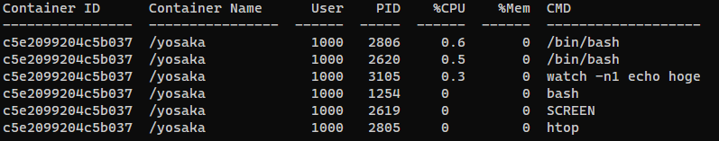

# dockertop

Dockertop makes it easy to get the PID information of a container.
Dockertop is implemented in Python3.x and binary files are available.

## Installation
The OS to be used is assumed to be Linux.
Cloning and install with pip
```bash
git clone git@github.com:yosaka1138/dockertop.git
cd dockertop
pip install .
```

## Specified Container name
```bash
dockertop -name {{container_name}}
```
If you want to show all containers with the specified name, use the argument `-incl`.
```bash
dockertop -name {{container_name}} -incl
```


## Specified PID
```bash
dockertop -p 1234
```
